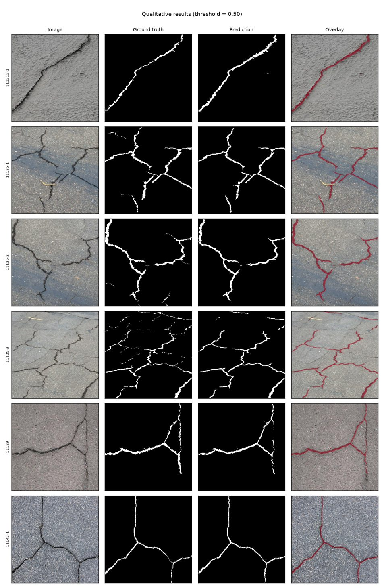
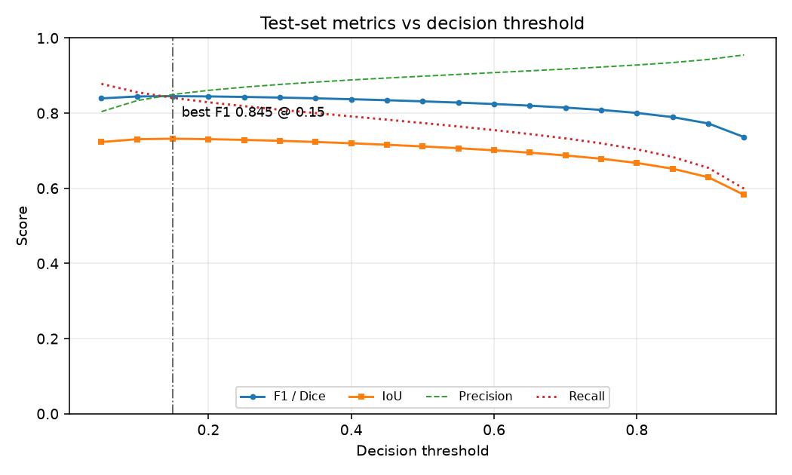

# Crack Detection with U-Net (DeepCrack)

Binary semantic segmentation of surface cracks in concrete, asphalt and masonry
photographs, trained on the [DeepCrack](https://doi.org/10.1016/j.neucom.2019.01.036)
dataset. The repository contains a from-scratch U-Net, a ResNet34-encoder
variant, a full training and evaluation pipeline, a prediction CLI and a Flask
web interface that turns an uploaded photograph into a crack mask, an overlay
and a crack-coverage measurement.

A small **CPU demo model** (7.9 MB, test IoU 0.71 / F1 0.83, see
[Bundled CPU demo model](#bundled-cpu-demo-model)) is committed, so the web UI and
the prediction CLI work straight after cloning, before you train anything.

[](https://www.python.org/downloads/)
[](https://pytorch.org/)
[](https://flask.palletsprojects.com/)
[](https://docs.pytest.org/)
[](https://black.readthedocs.io/)
[](LICENSE)

---

## Features

- **Two architectures.** A from-scratch U-Net with configurable depth and width,
  and a U-Net decoder on a torchvision ResNet34 ImageNet encoder. Both are
  reached through a single `build_model(name, **kwargs)` factory.
- **Loss functions for sparse targets.** Dice, BCE+Dice, Focal and Tversky, all
  computed from logits with `BCEWithLogitsLoss` for numerical stability. Crack
  pixels are a few percent of a frame, so plain BCE alone under-segments badly.
- **Honest metrics.** IoU, Dice/F1, precision, recall and pixel accuracy are
  accumulated as confusion counts across the whole split and computed once, not
  averaged per batch. A threshold sweep finds the best-F1 operating point in a
  single pass.
- **Aligned augmentation.** Random crops, flips and 90-degree rotations are
  applied identically to image and mask; brightness and contrast jitter touch
  the image only. Masks are always resampled with nearest-neighbour.
- **Training niceties.** AdamW, cosine or plateau LR schedules with warmup,
  AMP, gradient clipping, early stopping on validation Dice, best/last
  checkpointing, resume, TensorBoard logging and a `--dry-run` smoke test.
- **Tiled inference.** Images larger than the training size are processed as
  overlapping tiles blended with a Gaussian window, so a high-resolution
  photograph is not squashed until the cracks disappear.
- **Web interface.** Upload an image, see original / mask / overlay side by
  side, read the crack-pixel ratio and an indicative crack length, adjust the
  threshold and re-run, and download the overlay. A JSON API mirrors the UI.
- **Works out of the box.** A bundled CPU-trained demo checkpoint is used
  automatically until you train your own `checkpoints/best.pt`.
- **Fails clearly.** Unpaired dataset files raise a named error instead of being
  skipped; a missing checkpoint produces an explanatory page, not a traceback.

## Tech stack

| Layer | Choice |
| --- | --- |
| Deep learning | PyTorch 2.2+, torchvision |
| Imaging | Pillow, OpenCV (headless), NumPy |
| Configuration | YAML (`pyyaml`) with environment overrides (`python-dotenv`) |
| Experiment tracking | TensorBoard |
| Figures | Matplotlib |
| Web | Flask 3, Jinja2, Bootstrap 5 (CDN) |
| Testing | pytest |
| Tooling | black, ruff |

## Project structure

```
crack-detection-deepcrack/
├── app/                        Flask web interface
│   ├── __init__.py             Application factory, config, error handlers
│   ├── routes.py               Views, JSON API, lazy model singleton
│   ├── static/css/app.css      Small layer on top of Bootstrap 5
│   └── templates/
│       ├── base.html           Shared layout
│       ├── index.html          Upload form and model status
│       ├── result.html         Original | mask | overlay + measurements
│       └── errors/             400, 404, 413, 500 pages
├── configs/
│   ├── unet.yaml               Baseline U-Net from scratch (GPU recipe)
│   ├── unet_resnet34.yaml      Transfer-learning variant (ImageNet ResNet34 encoder)
│   └── unet_cpu_demo.yaml      Small U-Net used to train the bundled demo model on CPU
├── docs/images/                Figures referenced by this README
├── samples/                    Two test-split images (+ masks/ with their ground truth)
├── scripts/
│   └── download_data.py        kagglehub / Kaggle CLI download, or import a local copy
├── src/
│   ├── config.py               Dataclass config: YAML + env + CLI overrides
│   ├── dataset.py              Pairing, splitting, DataLoaders
│   ├── transforms.py           Joint image/mask augmentation
│   ├── model/
│   │   ├── __init__.py         build_model factory
│   │   ├── blocks.py           DoubleConv, Down, Up, OutConv
│   │   ├── unet.py             U-Net from scratch
│   │   └── unet_resnet.py      U-Net with a ResNet34 encoder
│   ├── losses.py               Dice, BCE+Dice, Focal, Tversky
│   ├── metrics.py              Confusion-count metrics + threshold sweep
│   ├── engine.py               train_one_epoch / validate / early stopping
│   ├── train.py                Training CLI
│   ├── evaluate.py             Test-set evaluation, metrics.json, figures
│   ├── predict.py              Single image or directory inference CLI
│   └── utils.py                Seeding, devices, checkpoints, overlays, tiling
├── tests/                      pytest suite (no dataset required)
├── checkpoints/                Your trained weights (git-ignored)
│   └── demo/                   Bundled CPU demo model + its measured metrics
├── reports/figures/            Generated metrics and plots (git-ignored)
├── runs/                       TensorBoard event files (git-ignored)
├── run.py                      Development server entry point
├── requirements.txt
├── pyproject.toml
├── .env.example
└── LICENSE
```

## Prerequisites

- Python 3.10 or newer
- About 2 GB of disk space for the dataset and checkpoints
- A CUDA GPU is optional. Training the baseline on CPU is slow but works;
  reduce `data.image_size` and `train.batch_size` first.
- A Kaggle account and API token if you want `scripts/download_data.py` to
  fetch the dataset for you (not needed if you already have a copy).

## Installation

**Windows (PowerShell or cmd)**

```bat
git clone https://github.com/<your-org>/crack-detection-deepcrack.git
cd crack-detection-deepcrack
python -m venv .venv
.venv\Scripts\activate
python -m pip install --upgrade pip
pip install -r requirements.txt
copy .env.example .env
```

**Linux / macOS**

```bash
git clone https://github.com/<your-org>/crack-detection-deepcrack.git
cd crack-detection-deepcrack
python3 -m venv .venv
source .venv/bin/activate
python -m pip install --upgrade pip
pip install -r requirements.txt
cp .env.example .env
```

For a GPU build of PyTorch, install it from the official index before the
requirements file, for example:

```bash
pip install torch torchvision --index-url https://download.pytorch.org/whl/cu126
```

### Try it immediately

No dataset or training is needed to try the UI and the CLI; the bundled demo
model is picked up automatically:

```bash
python run.py                                  # open http://127.0.0.1:5000 and upload samples/11289-11.jpg
python -m src.predict --input samples/         # writes masks and overlays to reports/predictions/
```

Editable install (optional, gives you the `crack-train` / `crack-evaluate` /
`crack-predict` console scripts):

```bash
pip install -e ".[dev]"
```

## Configuration

Settings come from `configs/*.yaml`, and environment variables (read from
`.env` when present) override them. Everything has a working default, so the
repository runs without a `.env` file as long as the dataset sits at
`../_datasets/deep_crack_dataset` relative to the project root.

| Variable | Default | Purpose |
| --- | --- | --- |
| `DATA_DIR` | `../_datasets/deep_crack_dataset` | Dataset root containing the four split directories |
| `CHECKPOINT_PATH` | *(unset)* | Checkpoint used by evaluation, prediction and the web app. When unset: `<train.checkpoint_dir>/best.pt` if it exists, otherwise the bundled `checkpoints/demo/unet_cpu_demo.pt` |
| `CONFIG_PATH` | `configs/unet.yaml` | YAML config used when a CLI passes no `--config` |
| `DEVICE` | `auto` | `auto`, `cuda`, `cpu` or `mps` |
| `NUM_WORKERS` | `4` | DataLoader worker processes; use `0` on Windows if workers misbehave |
| `RANDOM_SEED` | `42` | Seed for Python, NumPy and PyTorch |
| `MAX_UPLOAD_MB` | `16` | Upload size cap for the web UI |
| `FLASK_ENV` | *(unset)* | `development` (as in `.env.example`) enables the Flask debugger in `run.py` |
| `SECRET_KEY` | *(generated)* | Flask session signing key; set a real one for any deployment |
| `LOG_LEVEL` | `INFO` | `DEBUG`, `INFO`, `WARNING` or `ERROR` |

Key YAML blocks:

| Block | Notable keys |
| --- | --- |
| `data` | `image_size`, `val_split`, `num_workers`, split directory names, file suffixes |
| `augment` | `random_crop`, `crop_scale`, `hflip_prob`, `vflip_prob`, `rot90_prob`, `brightness`, `contrast` |
| `model` | `name` (`unet`, `unet_resnet34`), `base_channels`, `depth`, `bilinear`, `pretrained` |
| `loss` | `name` (`bce_dice`, `dice`, `focal`, `tversky`, `bce`), mixing weights, `pos_weight` |
| `train` | `epochs`, `batch_size`, `lr`, `scheduler`, `warmup_epochs`, `grad_clip`, `amp`, `early_stopping_patience` |
| `eval` | `threshold`, `threshold_sweep`, `num_qualitative` |
| `inference` | `tile_size`, `tile_overlap`, `sliding_window_min_size`, `pixel_size_mm` |

## Usage

### Get the dataset

```bash
# 1. kagglehub (default). Needs a Kaggle API token: ~/.kaggle/kaggle.json
#    (%USERPROFILE%\.kaggle\kaggle.json on Windows) or KAGGLE_USERNAME / KAGGLE_KEY.
python scripts/download_data.py                    # -> ../_datasets/deep_crack_dataset

# 2. The Kaggle CLI instead
pip install kaggle
python scripts/download_data.py --method cli

# 3. A copy you already have: a folder (verified, used in place) or the .zip (extracted)
python scripts/download_data.py --local D:\sample_projects\_datasets\deep_crack_dataset
python scripts/download_data.py --local D:\Downloads\archive.zip --data-dir D:\sample_projects\_datasets\deep_crack_dataset
```

| Flag | Meaning |
| --- | --- |
| `--data-dir` | Destination directory; defaults to `$DATA_DIR`, else `../_datasets/deep_crack_dataset` (relative to the repository root) |
| `--method` | `kagglehub` (default) or `cli` |
| `--local` (alias `--archive`) | Use an existing folder or `.zip` instead of downloading |
| `--copy` | With `--local <folder>`: copy it into `--data-dir` instead of using it in place |
| `--force` | Download again even when the dataset is already present |
| `--log-level` | Logging verbosity |

With the repository cloned to `D:\sample_projects\crack-detection-deepcrack`, the
default data directory resolves to `D:\sample_projects\_datasets\deep_crack_dataset`,
so a dataset already there needs no configuration. Anywhere else, set `DATA_DIR`
in `.env` (for example `DATA_DIR=D:\sample_projects\_datasets\deep_crack_dataset`)
or pass `--data-dir` to the train and evaluate commands.

### Train

Full-quality training (GPU recommended; `unet.yaml` trains at 384x384 for up to 40
epochs, `unet_resnet34.yaml` downloads ImageNet ResNet34 weights on first use):

```bash
python -m src.train --config configs/unet.yaml
python -m src.train --config configs/unet_resnet34.yaml --epochs 30 --batch-size 4
python -m src.train --dry-run                     # two batches, nothing saved
python -m src.train --resume checkpoints/last.pt
```

Reproduce the bundled CPU demo model (about 27 minutes on one CPU core; it
writes to `checkpoints/cpu_demo/`):

```bash
python -m src.train --config configs/unet_cpu_demo.yaml
python -m src.evaluate --config configs/unet_cpu_demo.yaml --checkpoint checkpoints/cpu_demo/best.pt
```

| Flag | Meaning |
| --- | --- |
| `--config` | YAML config file |
| `--data-dir`, `--num-workers` | Dataset overrides |
| `--model`, `--loss` | Architecture / objective overrides |
| `--epochs`, `--batch-size`, `--lr`, `--weight-decay`, `--scheduler` | Optimisation overrides |
| `--device`, `--seed` | Hardware and reproducibility |
| `--no-amp`, `--no-augment` | Disable mixed precision / augmentation |
| `--resume` | Continue from a checkpoint (weights, optimiser, scheduler, scaler) |
| `--experiment-name` | Names the TensorBoard run and metric summary |
| `--dry-run` | Two train and two validation batches, then exit |

Checkpoints land in `checkpoints/` (`best.pt` by validation Dice, `last.pt`
every epoch). Follow training with:

```bash
tensorboard --logdir runs
```

### Evaluate

```bash
python -m src.evaluate --checkpoint checkpoints/best.pt
python -m src.evaluate --threshold 0.4 --num-qualitative 8
python -m src.evaluate --no-figures
```

| Flag | Meaning |
| --- | --- |
| `--checkpoint` | Checkpoint to evaluate (defaults to `$CHECKPOINT_PATH`) |
| `--threshold` | Fixed decision threshold reported alongside the sweep |
| `--batch-size`, `--device` | Runtime overrides |
| `--num-qualitative` | Rows in the qualitative figure |
| `--no-figures` | Write `reports/metrics.json` only |

Writes `reports/metrics.json`, `reports/figures/threshold_f1.png` and
`reports/figures/qualitative_grid.png`. A checkpoint is always run at the input
size it was trained with (stored in the checkpoint), whichever config is active.

### Predict

```bash
python -m src.predict --input samples/11289-11.jpg
python -m src.predict --input samples/ --threshold 0.4 --csv reports/predictions.csv
python -m src.predict --input big_photo.jpg --tile
```

| Flag | Meaning |
| --- | --- |
| `--input`, `-i` | Image file or directory (required) |
| `--output-dir`, `-o` | Where masks and overlays are written |
| `--checkpoint`, `--config`, `--device` | Model selection |
| `--threshold` | Decision threshold |
| `--csv` | Also write a per-image summary CSV |
| `--tile` / `--no-tile` | Force or forbid sliding-window inference |
| `--alpha` | Overlay blend factor |

Each input produces `<stem>_mask.png` and `<stem>_overlay.png` plus a logged
crack-pixel ratio and indicative crack length.

### Run the web interface

```bash
python run.py                       # http://127.0.0.1:5000
python run.py --host 0.0.0.0 --port 8000 --debug
```

For anything beyond local use, serve it through a real WSGI server:

```bash
pip install waitress   # or: pip install gunicorn
waitress-serve --port=8000 --call app:create_app     # Windows-friendly
gunicorn -w 2 -b 0.0.0.0:8000 "app:create_app()"     # POSIX
```

The app loads `CHECKPOINT_PATH`, else your `checkpoints/best.pt`, else the
bundled demo model. If none of them exists it still starts and explains how to
train one instead of raising.

## Application routes

| Method | Route | Description |
| --- | --- | --- |
| `GET` | `/` | Upload form, threshold slider, model status banner |
| `POST` | `/predict` | Runs inference on an upload and renders original, mask, overlay and measurements |
| `GET` | `/download/<token>` | Downloads the overlay PNG generated by the last prediction |
| `POST` | `/api/predict` | JSON inference: multipart `image` or `{"image_base64": ..., "threshold": ...}`; returns crack statistics and base64 PNGs |
| `GET` | `/api/health` | Liveness probe: version, model name, device, whether a checkpoint is available |

Example API call:

```bash
curl -F "image=@samples/11289-11.jpg" -F "threshold=0.5" \
     http://127.0.0.1:5000/api/predict
```

```json
{
  "threshold": 0.5,
  "width": 544,
  "height": 384,
  "crack_pixels": 4821,
  "crack_pixel_ratio": 0.023,
  "crack_pixel_percent": 2.3068,
  "estimated_crack_length_px": 612.0,
  "detected": true,
  "mask_png_base64": "iVBORw0KGgo...",
  "overlay_png_base64": "iVBORw0KGgo..."
}
```

*(Illustrative response shape; the numbers depend entirely on your trained
model and input image.)*

## Dataset

The DeepCrack dataset contains 537 RGB photographs of cracked surfaces with
manually annotated pixel-level masks, split by the authors into 300 training
and 237 test frames.

```
deep_crack_dataset/
├── README.md        Citation and contact details
├── train_img/       300 RGB photographs, .jpg
├── train_lab/       300 binary masks,    .png
├── test_img/        237 RGB photographs, .jpg
└── test_lab/        237 binary masks,    .png
```

Conventions this repository relies on, confirmed against the files:

| Property | Value |
| --- | --- |
| Image format | `.jpg`, RGB, 8-bit |
| Mask format | `.png`, single-channel (`L`), values **0 and 255 only** |
| Pairing rule | **Identical file stems.** `train_img/11111.jpg` pairs with `train_lab/11111.png`; `test_img/11125-1.jpg` with `test_lab/11125-1.png` |
| Frame size | 544x384 (landscape) or 384x544 (portrait); both orientations appear in the test split |
| Class balance | Crack pixels are a small minority of each frame, which is why the default objective is BCE+Dice |

Masks are converted to float 0.0/1.0 of shape `(1, H, W)` at load time. Images
and masks are resized together to `data.image_size` (default 384x384), with
bilinear interpolation for the image and nearest-neighbour for the mask.
`discover_pairs` raises `DatasetPairingError` naming the offending stems if any
image lacks a mask or vice versa, rather than silently dropping them. The
`test_*` directories are never used for training or validation: the
train/validation split is carved out of `train_img` alone with a fixed seed.

Two test-split images are checked into `samples/` (with their ground-truth
masks in `samples/masks/`) so the CLIs and web app can be exercised without
downloading the full dataset. They were picked as typical cases: the demo model's
per-image F1 on them is close to its median over the test split. They remain
under the dataset authors' terms.

## Bundled CPU demo model

`checkpoints/demo/unet_cpu_demo.pt` (7.9 MB, weights only) exists so the project
is usable right after cloning. It is **a CPU demo model, not a tuned one**:

| | |
| --- | --- |
| Recipe | `configs/unet_cpu_demo.yaml`: U-Net from scratch, `base_channels: 16` (1.96M parameters), 256x256 input, BCE+Dice, AdamW lr 1e-3 with cosine decay, batch 8, 16 epochs |
| Data | 255 training / 45 validation images from `train_img` (seeded split); the test split was not used for training or model selection |
| Hardware | CPU only, one thread, about 27 minutes (~100 s per epoch) |
| Selected epoch | 15 (best validation Dice 0.795) |

Measured on all 237 test images (`test_img` / `test_lab`):

| Evaluation | Threshold | IoU | F1 / Dice | Precision | Recall |
| --- | --- | --- | --- | --- | --- |
| `python -m src.evaluate` (256x256 network resolution) | 0.50 | 0.711 | 0.831 | 0.898 | 0.774 |
| same, best-F1 threshold from the sweep | 0.15 | 0.732 | 0.845 | 0.850 | 0.841 |
| Full resolution (544x384 frames, as the CLI and web UI see them) | 0.50 | 0.683 | 0.811 | 0.878 | 0.754 |

Pixels are pooled over the whole split (dataset-level metrics, not a per-image
average). The numbers are stored in `checkpoints/demo/unet_cpu_demo_metrics.json`
and the first two rows are reproduced by:

```bash
python -m src.evaluate --config configs/unet_cpu_demo.yaml --checkpoint checkpoints/demo/unet_cpu_demo.pt
```

The demo model tends to miss faint, blurred or hairline cracks (recall is lower
than precision); lowering the threshold in the UI trades precision for recall.
Train with `configs/unet.yaml` or `configs/unet_resnet34.yaml` on a GPU for
better results; your `checkpoints/best.pt` then takes precedence automatically.

### Citation

```bibtex
@article{liu2019deepcrack,
  title={DeepCrack: A Deep Hierarchical Feature Learning Architecture for Crack Segmentation},
  author={Liu, Yahui and Yao, Jian and Lu, Xiaohu and Xie, Renping and Li, Li},
  journal={Neurocomputing},
  volume={338},
  pages={139--153},
  year={2019},
  doi={10.1016/j.neucom.2019.01.036}
}
```

Dataset by the Computer Vision and Remote Sensing Lab, Wuhan University. It is
not redistributed here; download it from Kaggle
(`rukiyeaydn/deepcrack-dataset`) and respect the authors' terms.

## Figures

Produced by `python -m src.evaluate` with the bundled demo model on the test
split (first six test images, threshold 0.5):





Web UI screenshots are not committed; save your own as `docs/images/upload.png`
and `docs/images/result.png` if you want them here.

## Testing

The suite builds its own synthetic DeepCrack-shaped dataset in a temporary
directory, so it runs on a clean clone with no dataset and no checkpoint.

```bash
pip install -e ".[dev]"      # or: pip install pytest
pytest                       # whole suite
pytest tests/test_metrics.py -v
pytest -k "sliding_window"
```

What is covered:

- dataset pairing by stem, including the error raised for unpaired files
- augmentation keeping image and mask aligned across flips and rotations
- U-Net and ResNet34-U-Net forward shapes, including odd input sizes
- Dice loss of a perfect prediction approximately 0, and loss ordering/stability
- metrics against a hand-computed confusion matrix, and dataset-level (not
  per-batch-averaged) accumulation
- sliding-window inference matching direct inference on a small image
- Flask `/api/health`, the missing-checkpoint path, upload validation and an
  end-to-end prediction against a freshly saved checkpoint
- mask statistics and overlays for both 0/1 and 0/255 masks
- `scripts/download_data.py` with a local folder, a local `.zip` and a mocked
  kagglehub download
- the bundled demo checkpoint: size, fallback resolution and a real prediction on
  a sample image

## Roadmap

- Test-time augmentation (flip/rotation ensembling) for the evaluation CLI
- Connected-component filtering to drop speckle before length estimation
- Calibrated crack-width measurement from the distance transform
- Additional encoders (EfficientNet, MiT) behind the same factory
- ONNX / TorchScript export for deployment without a Python runtime
- Batched multi-image upload in the web UI
- A Dockerfile and a GitHub Actions workflow running the test suite

## Limitations

- **Only a demo model is shipped.** The bundled checkpoint is a small model
  trained for 27 minutes on a CPU; its metrics (above) are real but modest. The
  numbers in the example API response are illustrative. Metrics for the full
  `unet` and `unet_resnet34` recipes are not published here: run them yourself.
- **Domain shift.** DeepCrack frames are close-range, reasonably well-lit
  photographs. Performance on drone imagery, wet or stained surfaces, shadows,
  or very different capture distances will be substantially worse without
  fine-tuning.
- **Crack length is indicative.** The length estimate is derived from the mask
  skeleton (or its perimeter when OpenCV's thinning is unavailable) in pixels.
  It becomes a physical measurement only once you set
  `inference.pixel_size_mm`, and even then it ignores perspective.
- **No severity assessment.** The model segments cracks; it does not classify
  crack type, measure width reliably or judge structural significance.
- **Not an inspection tool.** Output is for research and demonstration and is
  not a substitute for a qualified structural engineering inspection.
- **Single-class.** Everything is binary crack/background. Multi-class
  distress segmentation (spalling, potholes, joints) is out of scope.

## License

Released under the MIT License. See [LICENSE](LICENSE).

The DeepCrack dataset is distributed by its authors under their own terms and
is not covered by this license.
